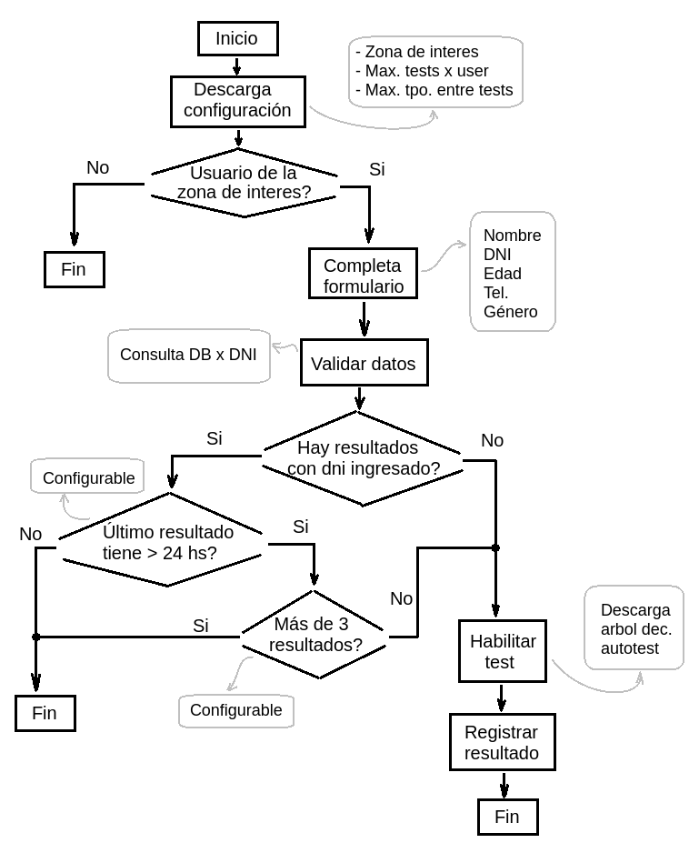

# covid19-autotest-uns

En este proyecto se intenta implementar: 
  - Una aplicación que guía al usuario por un árbol de decisiones para determinar su situación y registra en una base de datos su estado actual.  
  - Un panel de administración para configurar el árbol de decisión y un tablero con métricas de los datos registrados.


## Diagrama de flujo de la aplicación
 

## Formato objeto de configuracion
```json
{
	"locationFilter":{
		"lat":-38.7164681,
		"lng":-62.2699996,
		"range": 1
	},
	"logsFilter":{
		"max":3,
		"elapsed":86400000
	}
}
```

## Formato arbol de decision autotest
```json
{
	"author": "admin@email.com",
	"timestamp": 1584817621486,
	"id": "T001",
	"tree":[
		{
			"header": "¿Viajaste recientemente a zonas de riesgo?",
			"content": "Países con circulación de virus o aeropuertos internacionales",
			"options":[
				{
					"text":"Si",
					"goto":"1"
				},
				{
					"text":"No",
					"goto":"2"
				}
			]
		},
		{
			"header": "¿Tenés alguno de los siguientes síntomas?",
			"content": "<ul><li>Fiebre</li><li>Tos</li><li>Dolor de garganta</li></ul><p>Indicá si es con o sin dificultad respiratoria (falta de aire):",
			"options":[
				{
					"text":"Sí, <b><i>con</i></b> dificultad respiratoria",
					"goto":"4",
					"color": "#B40404"
				},
				{
					"text":"Sí, <b><i>sin</i></b> dificultad respiratoria",
					"goto":"3",
					"color": "#B404AE"
				},
				{
					"text":"Ningún síntoma",
					"goto":"3",
					"color": "#013ADF"
				}	
			]
		},
		{
			"header":"¿Estuviste en contacto con un caso sospechoso, confirmado o persona que viajó al exterior?",
			"options":[
				{
					"text":"Sí",
					"goto":"1"
				},
				{
					"text":"No",
					"goto":"3"
				}
			]
		},
		{
			"header":"Es obligación que realices aislamiento social y preventivo en tu domicilio. Además es importante:",
			"content": "<ul><li>Lavate las manos con agua y jabón.</li><li>Tosé y estornudá en el pliegue del codo.</li><li>Ventilá y limpiá objetos y superficies que uses mucho.</li><li>Evitá besos, abrazos y compartir mate.</li></ul><br><p>Ante alguna duda podés realizar la consulta al Departamento de Epidemología y Calidad de la Secretaría de Salud: <a href='tel:+5492914390105'>+54 9 291 439-0105</a>.</p><center><h3>Cuidarnos es aislarnos</h3></center>",
			"options":[
				{
					"text":"+54 9 291 439-0105",
					"href":"tel:+5492914390105"
				},
				{
					"text":"Finalizar",
					"goto":"-1",
					"exitCode": "S001"
				}
			]
		},
		{
			"header":"Proceda comunicándose con:",
			"content": "<ul><li>Servicio de Emergencias: <a href='tel:148'>148</a></li></ul>",
			"options":[
				{
					"text":"Llamar 148",
					"href":"tel:148",
					"color":"#B40404",
					"exitCode": "S002"
				},
				{
					"text":"Finalizar",
					"goto":"-1",
					"exitCode": "S002"
				}
			]
		}
	]
}
```

## Reglas de seguridad Firestore
```
service cloud.firestore {
  match /databases/{database}/documents {
    match /results/{document=**} {
      allow read: if true;
      allow create: 
        if request.resource.data.exitCode is string && 
           request.resource.data.dni is number &&
           request.resource.data.dni > 1000000 &&
           request.resource.data.actionStack is list;
    }
    match /errorLogs/{document=**} {
      allow read: if false;
      allow create: 
        if request.resource.data.errorMsg is string && 
           request.resource.data.origin is string &&
           request.resource.data.timestamp is number;
    }
    match /stats/{document=**} {
      allow read: if false;
      allow update: if true;
    }
    match /pathStats/{document=**} {
      allow read: if false;
      allow update: if true;
    }
  }
}
```

## Reglas de seguridad Realtime Database
```
{
  "rules": {
    "config":{
      ".read": true,
      ".write": "auth != null"
    },
    "decisionTrees":{
      ".read": true,
      ".write": "auth != null",
      ".indexOn": "timestamp"
    }
  }
}
```

## Contacto:

### Universidad Nacional del Sur
https://www.uns.edu.ar/

### Departamento de Epidemología y Calidad de la Secretaría de Salud
https://www.bahia.gob.ar/salud/