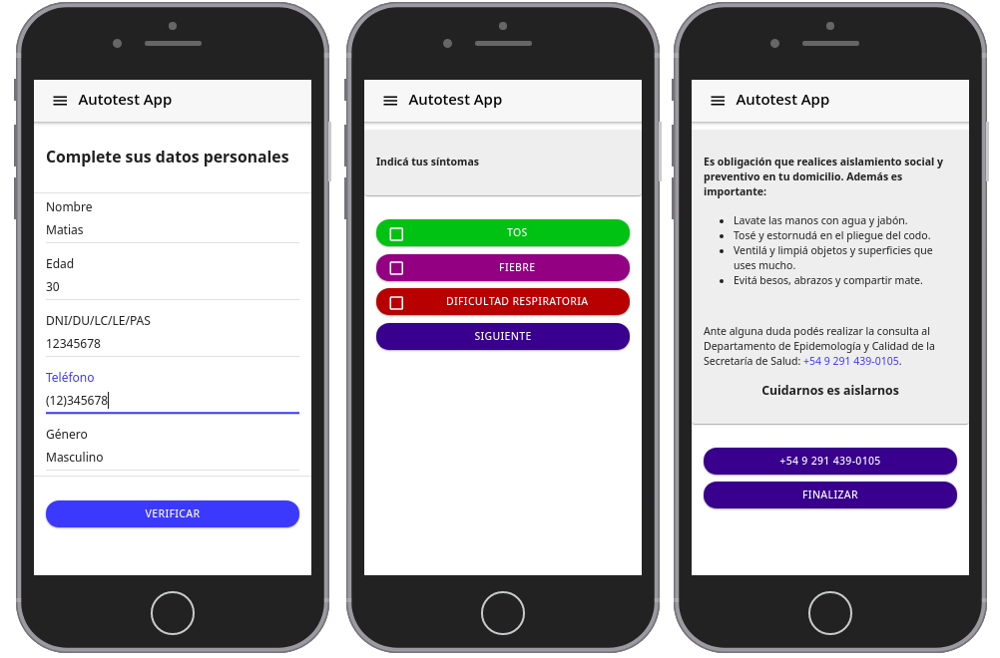
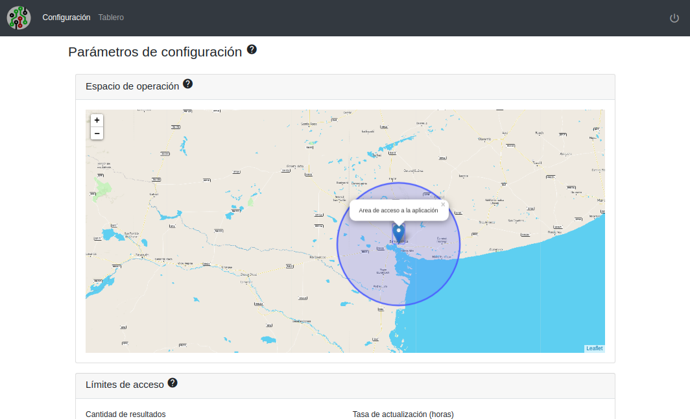
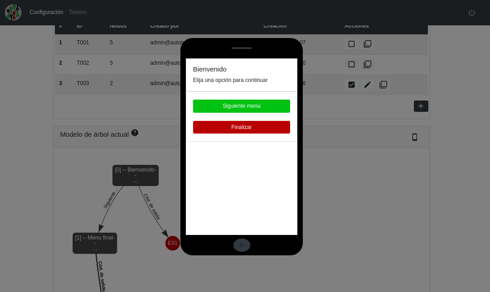

# autotest-app

Este proyecto se compone de dos aplicaciones
  - PWA orientada a móviles. Implementa una lista de menús que guían al usuario por un diagrama de flujo definido por un árbol de decisiones configurable. Los resultados que se obtienen luego haber completado el autotest se guardan, con referencia al árbol correspondiente, en la base de datos y también los datos de usuario y geolocalización.
  - Un panel de administración para crear y configurar los arboles de decisiones y un tablero con métricas de los datos registrados.

## Esquema general

Desde el panel de administrador se configura el sistema. Se define el área de operaciones como el espacio geográfico desde el cual los usuarios pueden acceder, la cantidad de tests que pueden responder por día y la cantidad máxima total.

 

## Diagrama de flujo de la aplicación

La aplicación implementa el siguiente diagrama de flujo que resume el funcionamiento:

 

## Capturas de pantalla

### Aplicación móvil
 

### Configuración de área de operación
 

### Creación/edición de arboles de decisión
 

### Simulador embebido para testear modelos
 

### Estadística de resultados
 

