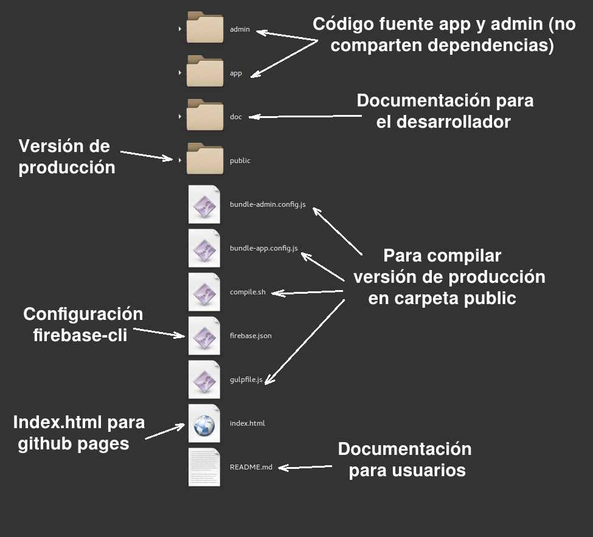
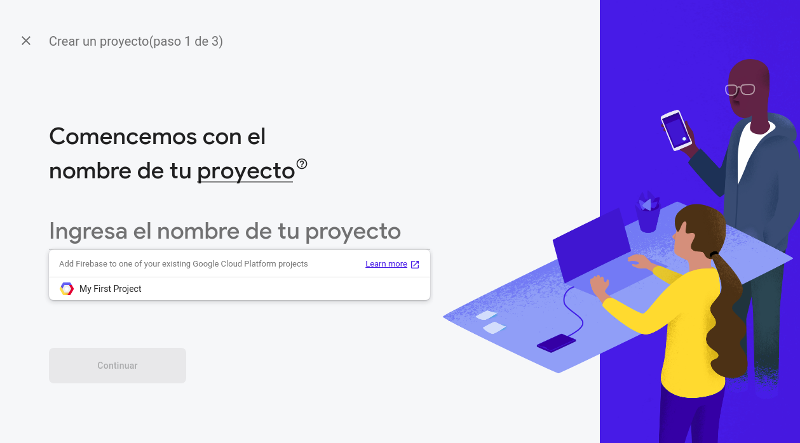
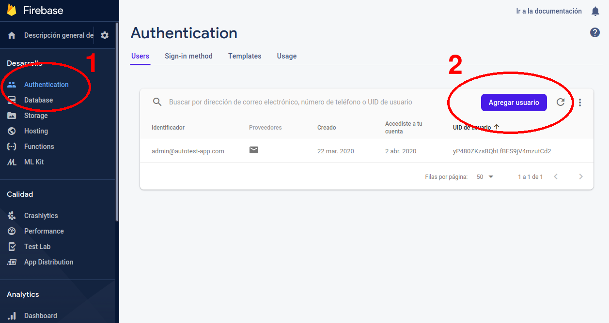
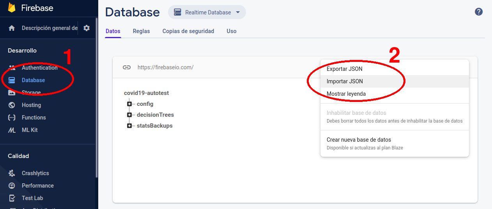
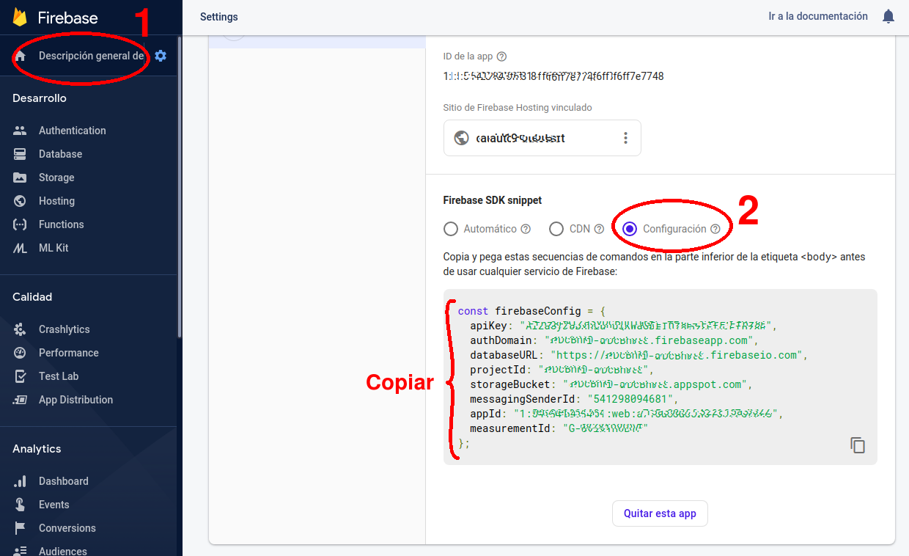

# Documentación


### 1 - Organización del directorio

Los archivos del proyecto están organizados de la siguiente manera:

 


### 2 - Crear proyecto Firebase

Este proyecto usa la versión de Firebase 7.12.0.  
Los CRUD Wrappers están disponibles en admin/custom/js ó app/custom/js

 


### 3 - Crear un usuario administrador

Una vez inicializado el proyecto, acceder a la consola de Firebase y crear un usuario con email y contraseña.

 

### 4 - Definir reglas de seguridad

En la sección reglas de seguridad de la base de datos de tiempo real, copiar el siguiente fragmento de código, reemplazando el uid "yP480ZKzsBQhLfBES9jV4mzutCd2" por el correspondiente UID del usuario administrador del sistema:

```
{
  "rules": {
    "config":{
      ".read": true,
      ".write": "auth.uid == 'yP480ZKzsBQhLfBES9jV4mzutCd2'"
    },
    "decisionTrees":{
      ".read": true,
      ".write": "auth.uid == 'yP480ZKzsBQhLfBES9jV4mzutCd2'",
      ".indexOn": ["active","timestamp"]
    },
    "statsBackups":{
      ".read": "auth.uid == 'yP480ZKzsBQhLfBES9jV4mzutCd2'",
      ".write": "auth.uid == 'yP480ZKzsBQhLfBES9jV4mzutCd2'"
    }
  }
}
```

En la sección reglas de seguridad de Firestore, copiar el siguiente fragmento de código:


```
service cloud.firestore {
  match /databases/{database}/documents {
    match /results/{document=**} {
      allow read: if true;
      allow create: 
        if request.resource.data.exitCode is string && 
           request.resource.data.dni is number &&
           request.resource.data.dni > 1000000 &&
           request.resource.data.actionStack is list;
    }
    match /errorLogs/{document=**} {
      allow read: if false;
      allow create: 
        if request.resource.data.errorMsg is string && 
           request.resource.data.origin is string &&
           request.resource.data.timestamp is number;
    }
    match /stats/{document=**} {
      allow read: if request.auth.uid != null;
      allow update: if true;
    }
    match /pathStats/{document=**} {
      allow read: if request.auth.uid != null;
      allow update: if true;
    }
  }
}
```

### 5 - Importar datos

Importar el archivo doc/realtime-db-export.json al root de la base de datos de tiempo real. Estos datos son de prueba, se pueden modificar en cualquier momento respetando la estructura básica del árbol.

 


### 6 - Editar claves de acceso a Firebase

En los archivos app/custom/js/middleware.js y admin/custom/js/middleware.js, editar la variable "firebaseConfig" y reemplazar por las credenciales correspondientes al nuevo proyecto creado.

 

### 7 - Hostear y ejecutar

La aplicación debe estar hosteada en sitio web con certificado SSL para que funcione como PWA.  
El panel de administrador no necesariamente debe ser público.